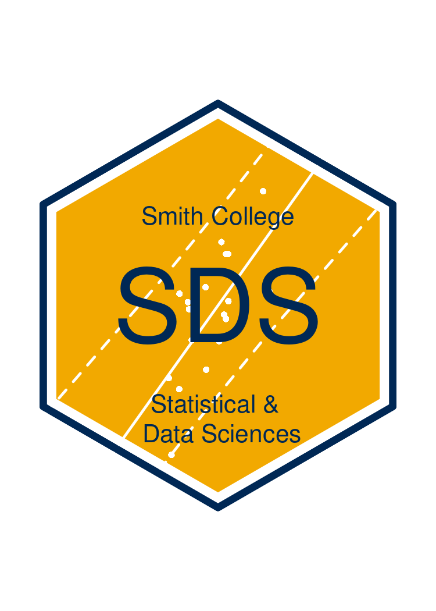

```{r include=FALSE}
library(ggplot2)
library(grid)
library(gridExtra)
library(gridtext)
library(dplyr)
library(magick)
library(jpeg)
library(png)
```
  

(it's a working title)

## Motivation

During the Spring 2020 semester, I introduced hypothesis testing to my 201 course using an example of a two-tailed hypothesis test (i.e., $H_A: \mu \ne 0$). This introduced some complexity (perhaps unnecessarily), which led to some confusion (very understandably), which I was able to resolve. Somewhat. Many students understood the mechanics of the procedure at a level of "this is what I need to do" and identify when to do them, but I don't think many students could explain precisely *why* these were the mechanics they needed to use. This document first attempts to explain some of the confusing situations students find themselves in when doing a hypothesis test, especially a two-tailed hypothesis test, and some ideas I've come up with for introducing big ideas of hypothesis testing in more concrete way.

The defining feature of a two-tailed hypothesis test is that the user divides their rejection rejection (usually evenly) between the two tails of their null hypothesis distribution. For example, if the Type I error rate $\alpha$ is chosen to be .05, the most extreme 2.5% of the distribution in the positive direction, and the most extreme 2.5% of the distribution in the negative direction, comprise the rejection region. In other words, you must set a trap at both exits from the distribution, taking special care to not make the combined size of your nets bigger than you originally promised.

However, students and practitioners alike struggle to keep their promises, and not make their nets bigger than agreed to, often because they get a glimpse of which direction their prey has bolted before they get around to making their nets. Whenever we perform a hypothesis test, one always obtains a test statistic before comparing it to the chosen $\alpha$ level. And, test statistics are inevitably signed; we can tell just by looking at the statistic whether it is positive or negative, and thus whether it is trying to escape the distribution at the upper or lower tail. From there, it is almost reflexive to compute the probability of observing a test statistic as extreme or more extreme than the one observed in the direction of the observed test statistic^[assuming the null hypothesis is true! I did not forget Andrew!], and compare this to the chosen $\alpha$ value to learn your fate.

Of course, this is the wrong thing to do; a p-value is **not** the probability of observing a test statistic as extreme or more extreme than the one observed in the direction of the *observed test statistic*, it is the probability of observing a test statistic as extreme or more extreme than the one observed in the direction of the *alternative hypothesis*. And, our alternative hypothesis was that a difference from 0 could occur in *either* the positive or negative direction. Thus, for our p-value to be a p-value, it must account for this.

However, to satisfy this constraint, one must often go through some contortions toward the end of the hypothesis test that feel arbitrary, and are easy to forget or do wrong. Unless using software with a "Two Tailed P-Value" option (great for practitioners, not particularly informative for learners), one must take the $\alpha$ level of their forefathers and, like King Solomon, divide the sacred value in two before comparing it to their p-value. Alternatively, they may take their p-value, the value that above all else must be small, and double it (double!) before comparing it to the $\alpha$ value. As an instructor, telling students to perform one of these steps feels a bit like telling students "you always compare your p-value to the chosen $\alpha$ level to make a decision, except for when you don't". These steps are effective, but now the hypothesis test feels more like the incantations one must recite in order to survive the class rather than a careful process of balancing discovery of the unknown against the possibility of being the next "boy who cried wolf".

A somewhat better approach than "just double your p-value" or "just halve your $alpha$" is to have students literally compute the probability of observing a test statistic as extreme or more extreme than they one they obtained in **both** tails of the distribution. This has the effect of "doubling the p-value", but brings the procedure closer to the stated alternative hypothesis; you *said* there could be a difference in either direction, and that you would look for a difference in either direction, so it's time to put your money where your mouth is and look. This approach "feels" even better if you've got a physical null hypothesis distribution to use, like the one you'd get by using a permutation distribution for your null hypothesis distribution.

But this is not tear-free either. To pull this off, we must take our obtained test statistic, use it once "as is", and then use it again with the sign flipped. This is another puzzling and seemingly arbitrary step - we *know* the difference is, say, positive; why am I suddenly worried about a world in which it is negative? Well, you can appeal to the definition of a p-value again if you like, and point out that changing your observed positive difference to a negative one gives you "a test statistic as extreme or more extreme than the one observed *in the direction of the alternative hypothesis*", which we've established must be in both tails of the distribution. But, leaning on this technicality feels unsatisfactory. Doubts linger; the class looks like you've just told them that *technically* the new the millennium  doesn't start until the year 2001 because there was no year zero. Eyes narrow.

At this point, it think the real question to address is: Why are we taking this "in the direction of the alternative hypothesis" caveat so damn seriously? A positive test statistic has been obtained, an $\alpha$ value has been set, why not just look in the upper tail? 

The real reason all the business with doubling p-values, checking both tails, etc., is so important comes back to the reason we have all of these procedures in the first place - control of the Type I error rate. If we wait until we we see the test statistic to decide which tail to compute the probability in, our Type I error rate won't be $\alpha$, it will be $2 \alpha$. One *can* point this out by appealing to the rates as which extreme events occur under the null hypothesis distribution. If you reject the null hypothesis because the test statistic is among the 5% most extreme positive values, **OR** reject the null hypothesis because the test statistic is among the 5% most extreme negative values, then your *true* $\alpha$ level, your *true* Type I error rate is .1, not .05 as you may have believed. You can even draw a flow chart leading to shaded regions of null hypothesis distribution, to put some pictures behind these words. 

But, pictures and words such as these can only go so far, because frankly, probability distributions are confusing to students. One well versed in the dark arts of minimizing squared error can look at a curve with a shaded region and interpret it quickly. But to more students than we'd like to admit, shaded regions don't immediately convey that "events in this region of the x-axis occur at a rate proportional to the area of the shaded region". This is not to say that they cannot understand this, just that we need to work harder to instill this understanding in them before they get to the point of a two-tailed hypothesis test. This is the matter at hand - instilling in students a more intuitive understanding of the hypothesis testing procedure by showing how NHST is a categorization task based on the rates of certain events occurring, and how the the distribution is the key to it all because it tells use the rates of these "certain events" occurring. 

My first instinct to try and get this across was to build a lab activity where students would use R to simulate two-tailed hypothesis tests under the correct procedures and the incorrect "test in the direction of the test statistic" procedure, and compare how often incorrectly rejected the null under both of these situations. As they say, if you can't program it, you don't understand it^[I don't think anyone says that.]. But such a simulation, even with some scaffolding from the instructor, isn't a trivial coding exercise. On further reflection, I realized such an activity might restrict the insight from such a simulation to those already more comfortable and skilled with R. 

So, I tried to think of an activity with less (or no) coding that retained the core idea; sampling a value that *may* come from one distribution that you know the details of or *may* come from a distribution that you do not know the details of, using the likelihood that the sampled value comes from the distribution you *do* know about to categorize it, and then pulling back the curtain at the end to see how many errors you made. And, I came up with the hypothesis testing card game.

## The Hypothesis Testing Card Game

### Prior to the game
Ideally, students have been introduced to the concept of a null hypothsis, an $\alpha$ level, and the the basic idea of rejecting the null hypothsis looking to see if a test statistic is unlikely under the distribution of possible values under the null hypothesis. Having the basic idea of "rare events, like those that occur less than 5% of the time, could be used as ground to abandon an assumption" will be immensly helpful at the point where students need to come up with a decision criteria for categorizing cards. 

### The Outline of the Game

The basic idea behind the activity is that students will perform many hypothesis tests themselves, using decks of cards as the null and alternative distributions. The details are as follows:

1. There exists two decks of custom playing cards; a "Regular deck" and a "Luxury VIP Deck". Cards have no suits, but each card still has a "face value" which represents an observed test statistic. The distribution of face values in the two  decks is as follows:

    ```{r echo=FALSE, fig.caption = "Distribution of face values in each card deck. Face values with identical counts in both decks have been jittered vertically to avoid obscuring any values", fig.width=9, fig.height=6, dev="svg"}
    deck_A_likelihoods <- data.frame(face =  c(0, 1, 2, 3, 4, 5, 6, 7, 8, 9, 10, 11, 12, 13, 14),
                                     count = c(2, 3, 4, 5, 6, 5, 4, 3, 2, 1, 1,  1,  1,  1,  1)
                                     )
    deck_B_likelihoods <- data.frame(face =  c(1, 2, 3, 4, 5, 6, 7, 8, 9, 10, 11, 12, 13, 14, 15),
                                     count = c(1, 1, 1, 1, 1, 1, 2,  3, 4,   5,  6,  5, 4, 3,  2)
                                     )
    all_deck_likelihoods <- bind_rows("A" = deck_A_likelihoods,
                                      "B" = deck_B_likelihoods,
                                      .id = "deck"
                                      ) %>%
      group_by(deck) %>%
      mutate(prob = count/sum(count)) %>%
      ungroup() %>%
      mutate(count = replace(count, deck=="A" & face==6, 3.975),
             count = replace(count, deck=="B" & face==6, 4.025),
             prob = replace(prob, deck=="A" & face==6, .0995),
             prob = replace(prob, deck=="A" & face==6, .1005)
             )

    ggplot(all_deck_likelihoods, aes(x=face,y=prob,color=deck)) +
      geom_segment(aes(xend=face+1, yend=prob),size=2) +
      geom_point(size=4) +
      scale_x_continuous("Face Value",
                         breaks = -2:15
                         ) + 
      scale_y_continuous("Probability",
                         limits = c(0,.20), breaks = seq(0,.20,.05)
                         ) +
      scale_color_brewer("Deck", palette = "Set1",
                         labels = c("A"="Regular", "B" = "VIP")
                         ) +
      theme_bw(22) +
      theme(panel.grid = element_blank(),
            legend.position = c(.875,.85))
    ```

2. Both decks of cards are shuffled together and distributed to students.
3. The premise of the game is that there has been a manufacuting error down at the playing card factory. All of these cards are *supposed* to be regular playing cards, but a bunch of special VIP playing cards got mixed in with all the "regular" playing cards. The VIP cards need to be found and removed, so they can be used at a high-stakes game for high rollers in Las Vegas. So, they've called in a specialist to clean up this messy situation: you (the student).


4. But, since VIP cards are so rare and exclusive, no one can tell you exactly what a VIP card looks like. All you *do* know is what a deck of regular playing cards look like. So, students are given the distribution of face values in a regular deck of cards (the red bars in the figure above), but not the distribution of face values in a VIP deck. However, students are told that the average face value of a VIP card is larger than the average face value of a regular card.
    - In other words, students are just given this information:
    ```{r echo=FALSE}
    ggplot(filter(all_deck_likelihoods, deck=="A"),
           aes(x=face,y=prob,color=deck)
           ) +
      geom_segment(aes(xend=face+1, yend=prob),size=2) +
      geom_point(size=4) +
      scale_x_continuous("Face Value",
                         breaks = -2:15
                         ) + 
      scale_y_continuous("Probability",
                         limits = c(0,.20), breaks = seq(0,.20,.05)
                         ) +
      scale_color_brewer("Deck", palette = "Set1",
                         labels = c("A"="Regular", "B" = "VIP")
                         ) +
      theme_bw(22) +
      theme(panel.grid = element_blank(),
            legend.position = c(.8,.8))
    ```
      
5. The task at hand is to go through the pile of cards, and remove the cards you believe to be VIP cards.
    - At this point, the class must deliberate on the best way to "detect" a VIP card based on the information provided. Naturally, one longs for more information about the VIP deck, and it is tempting to *assume* some distribution of values moderately larger than the regular deck distribution, and call any card with a value in that distribution a VIP card.
    - But, the instructor should draw students attention to the fact that all these cards are *supposed* to be regular cards; which is to say, we shoud assume a card is regular card until we have some reason to think otherwise. This should lead to noticing that some face values occur quite rarely, or not at all, in a regular deck of cards. Do your best to let students get their on their own, but you might suggest using a specific "rarity cutoff" for abandoning the "this is a regular card" assumption.
    - Try and avoid having a student "shout out" a decision rule. This activity gets a bit more interesting if everyone comes up with their own cutoff independently, so students will then have different false positive rates, etc.
6. Once the pile has been exhausted, and all cards beleived to be VIP cards removed to their own pile, students will use a serial number printed on the card to look up it's true "identity" in a master spreadsheet, and compare their chosen identity with the true identity to compute their categorization accuracy.
    - One key thing for students to notice is that their "False Positive" rate (proportion of "regular" cards categorized as a "VIP" card) should be directly related to their "rarity cutoff". If their cutoff was a face value that comprised 2.5% of the regular cards, then their false positive rate should be 2.5%.
7. Once finished, explain how each element of the game is found in hypothesis testing (Deck A is the null hypothesis distribution, Deck B is the alternative hypothesis, the decision rule is like $\alpha$, etc.).
9. After the analogy is completed, the two decks are re-shuffled together, and a single new probe card is drawn. This time, students have to categorize it as VIP or not, but they do not get to check their answer in the look-up table
    - They key thing to explain here is that this final task is like hypothesis testing in the real world. We never have access to a "truth table" that tell us whether we made the right choice in rejecting the null or not. All we can do is design the system to cap the number of errors (e.g., False Positives) at a certain level in the long run.

This could be "spiced up" by offering some sort of prize for keeping false positives below some threshold (e.g., 10%).

## Example of a Card
Customizing the cards could bring an element of fun *and* leaning to the activity. For example, you could customize the back of the cards with a logo (like the SDS logo), and the face of the card could be say, prominent women in statistics and data sciences.


```{r, fig.show = 'hold', out.width = "45%", results="asis", echo=FALSE}



face <- image_graph(width = 750, height = 1050, res = 300)
grid.raster(readJPEG("stephanie_hicks.jpg", TRUE))
invisible(dev.off())

mask <- image_graph(width = 750, height = 1050, res = 300)
grid.circle(x=0.5, y=0.5, r=.49, gp=gpar(fill="black"))
invisible(dev.off())

dev <- image_graph(width = 750, height = 1050, res = 300)
final <- image_draw(image_composite(mask, face, "plus"))

# x-bar, top right
grid.text(substitute(x==y,  list(y=2)), x = .85, y = .925, draw = TRUE,
          gp=gpar(fontsize=20)
          )
grid.lines(x=c(.74, .78), y=c(.95, .95), gp=gpar(lwd=4,lineend="square"))

grid.draw(richtext_grob("Stephanie<br>Hicks", x = .01, y = .99,
                        gp=gpar(fontsize=20), hjust=0, vjust=1)
          )

  # x-bar, bottom left
grid.text(substitute(x==y,  list(y=2)), x = .15, y = .075, draw = TRUE,
          gp=gpar(fontsize=20)
          )
grid.lines(x=c(.04, .08), y=c(.1, .1), gp=gpar(lwd=4,lineend="square"))

final
invisible(dev.off())
```


## Footnotes

